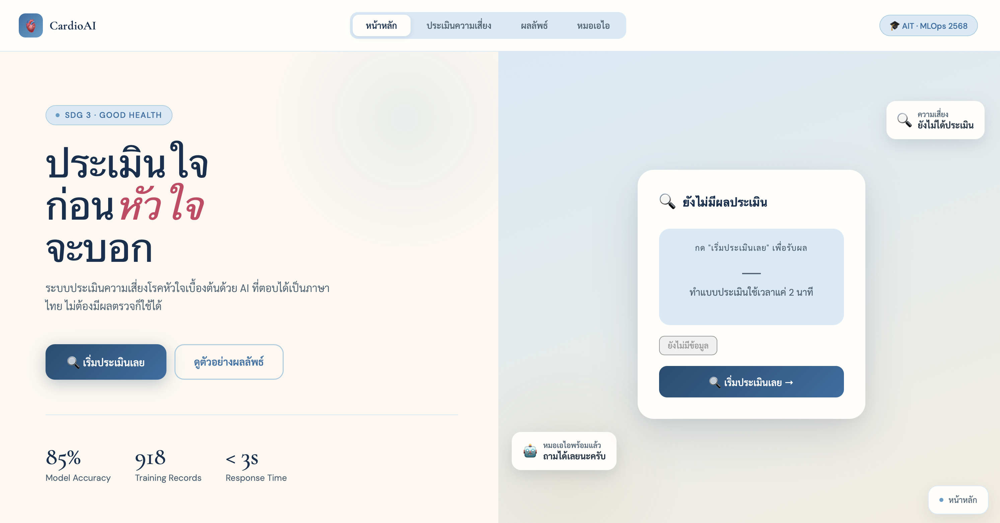
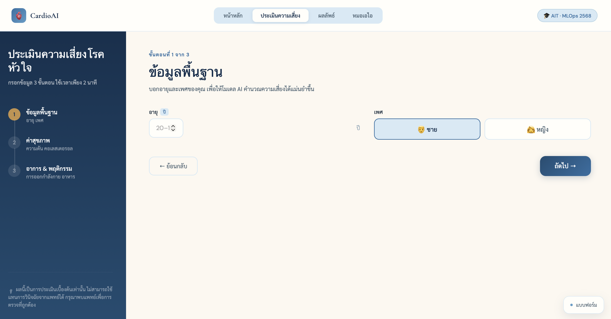
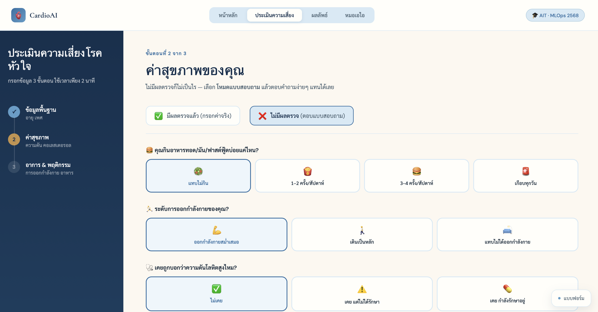
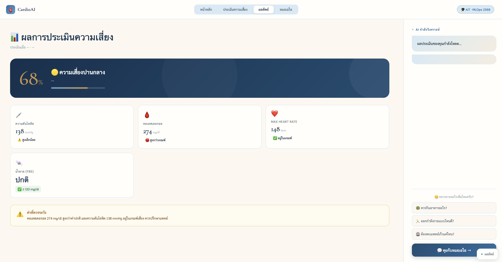
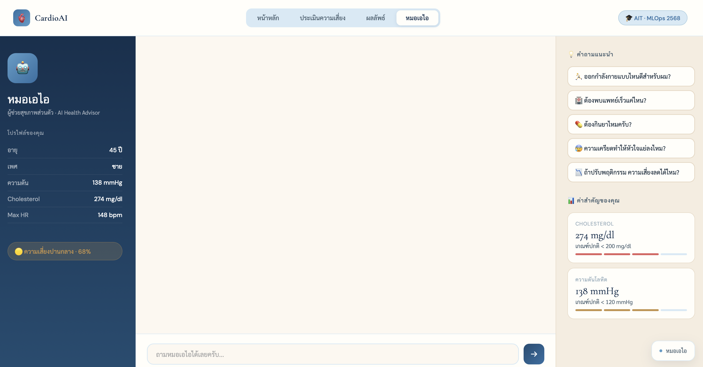

# 🫀 CardioAI

> Preliminary **heart-disease risk assessment** powered by machine learning, with a **Thai-language AI assistant** that explains the result in plain language.
>
> Users enter their health data → an ML model predicts a risk level → *"หมอเอไอ" (AI Doctor)* explains the result and gives guidance in Thai.

`FastAPI` · `scikit-learn` · `Typhoon LLM` · `Docker`

> ⚠️ **Disclaimer:** CardioAI is an educational screening tool. It provides a preliminary estimate only and is **not a substitute for professional medical diagnosis.**

---

## 📌 Overview

CardioAI lets everyday users self-assess their heart-disease risk. It supports two kinds of users with different data on hand:

- **Lab mode** — for users who have clinical results (blood pressure, cholesterol, ECG, etc.). Uses real clinical features for an accurate prediction.
- **Quiz mode** — for users with no lab results. They answer a lifestyle questionnaire (diet, exercise, family history, symptoms) and the risk is estimated from engineered proxy features.
- **AI Doctor (หมอเอไอ)** — a Thai-language chatbot that references the user's own risk result, answers follow-up questions, and advises seeing a doctor when appropriate.

## 📸 Screenshots

Home — start a risk assessment or view a sample result:



| Assessment — basic info | Assessment — health values (Lab mode) |
|:---:|:---:|
|  |  |

| Result (Random Forest) | AI Doctor — Thai-language assistant |
|:---:|:---:|
|  |  |

## ✨ Key Features

- **Two prediction modes** — clinical (Lab) and lifestyle-based (Quiz), each backed by its own trained model.
- **Calibrated probabilities** — the Quiz model outputs true probabilities (not just rankings), so the displayed risk % is meaningful.
- **Thai-language AI assistant** — explains results conversationally and grounds every answer in the user's own data.
- **Secure by design** — the LLM API key lives only on the backend; the browser never sees it.
- **Clinical-grade input validation** — Pydantic enforces realistic value ranges (e.g. Age 0–120, Cholesterol 0–700) and rejects bad input with a clear HTTP 422.
- **Runs on a fresh clone** — trained models ship with the repo; only the LLM chat needs an API key.
- **Tested & containerized** — pytest coverage for every endpoint, plus Docker/compose deployment.

## 🧠 Machine Learning Models

Trained on the [Heart Failure Prediction dataset](https://www.kaggle.com/datasets/fedesoriano/heart-failure-prediction) (918 cases), with two separate models tuned to the input type:

| | Lab mode | Quiz mode |
|---|----------|-----------|
| **Algorithm** | Random Forest | Gradient Boosting + Platt calibration |
| **Input** | 11 clinical features | Questionnaire answers → proxy features |
| **Performance** | Accuracy ~89% | Accuracy ~83%, Brier 0.13, ROC-AUC 0.86 |

**Design decisions:**
- The Lab model handles class imbalance with `class_weight="balanced"` and controls overfitting via `max_depth` / `min_samples_leaf`.
- The Quiz model uses **calibrated probability** (Platt scaling via `CalibratedClassifierCV`) so the displayed risk reflects a real likelihood, not just an ordering.
- Quiz-mode feature engineering derives proxy features from clinical data only and **never touches the target**, avoiding data leakage.
- Label-encoding consistency is covered by tests, so the API won't silently break if a library update changes encoder behavior.

## 🏗️ Architecture — how it works

```
Browser (real.html)
   │  POST /predict         ─►  FastAPI ─►  Random Forest         ─►  risk score
   │  POST /predict_quiz    ─►  FastAPI ─►  Gradient Boosting     ─►  risk score
   │  POST /chat            ─►  FastAPI ─►  Typhoon LLM           ─►  Thai explanation
   ▼
 risk score + level + advice, then a Thai explanation from the AI Doctor
```

1. The frontend collects health data and calls `/predict` (Lab) or `/predict_quiz` (Quiz).
2. FastAPI label-encodes the input to match training, runs the model, and returns a 0–100 risk score, a level (low / medium / high), and advice.
3. For follow-up questions, the frontend calls `/chat`. The backend builds a Thai system prompt injecting the patient's context + risk result, then proxies to the Typhoon LLM and returns the reply.

**Key engineering choices:**
- **The LLM key is backend-only** — the frontend calls `/chat` and never sees the key, which is read from an environment variable (never committed).
- **Config is separate from code** — API key, model name, and CORS origins are all set via environment variables, so the app moves between environments without code changes.

## 🛠️ Tech Stack

- **Backend:** FastAPI (Python 3.11) — serves both the REST API and the web page
- **ML:** scikit-learn (Random Forest, Gradient Boosting, `CalibratedClassifierCV`), joblib
- **LLM:** Typhoon (Thai language model) via a backend proxy
- **Frontend:** single-page HTML/CSS/JS
- **Deploy:** Docker + docker-compose
- **Testing:** pytest (mocks the model + LLM — no dataset or network needed)

## 🚀 Run locally

```bash
# 1. Install dependencies (a virtualenv is recommended)
python -m venv venv && source venv/bin/activate   # Windows: venv\Scripts\activate
pip install -r requirements.txt

# 2. Set your Typhoon API key (free signup at https://opentyphoon.ai)
cp .env.example .env          # then edit TYPHOON_API_KEY

# 3. Run (models are committed, so this works immediately)
uvicorn main:app --reload --port 8000
```

Open http://localhost:8000

> **About the Typhoon key:** the server won't start without `TYPHOON_API_KEY` in `.env` (it fails fast on purpose).
> - **Risk assessment (Lab / Quiz)** — pure ML, works out of the box.
> - **AI Doctor (chat)** — needs a **valid** Typhoon key to respond (free signup at https://opentyphoon.ai).

**Retrain the models (optional):** place `heart.csv` from Kaggle in the project root, then run:

```bash
python train_model-3.py && python train_model_quiz.py
```

### Docker

```bash
cp .env.example .env
docker compose up --build
```

## ✅ Tests

```bash
pip install -r requirements-dev.txt
pytest
```

Covers every endpoint (happy path + edge cases) and verifies label-encoding correctness. Runs from a clean clone with no real dataset (the model and LLM are mocked).

## 👤 My Contributions

**CardioAI was a team project.** I want to be clear about which parts were mine versus the team's.

**My work:**
- **Machine learning models & training** — built and tuned the risk-prediction models (`train_model-3.py`, `train_model_quiz.py`): the Random Forest for Lab mode and the calibrated Gradient Boosting for Quiz mode, including the proxy-feature engineering, probability calibration, and evaluation (accuracy, Brier score, ROC-AUC).
- **LLM chatbot integration** — designed the Thai-language "AI Doctor" experience: the system prompt, how the patient's risk context is injected into the conversation, and the flow that turns a raw risk score into a plain-language Thai explanation.

**Built with teammates:** the FastAPI backend/API layer and the HTML/CSS/JS frontend were developed collaboratively by the team.

> *This repository is my own cleaned-up copy of the group project, maintained for portfolio purposes.*

## 📄 License

Released under the [MIT License](LICENSE).
